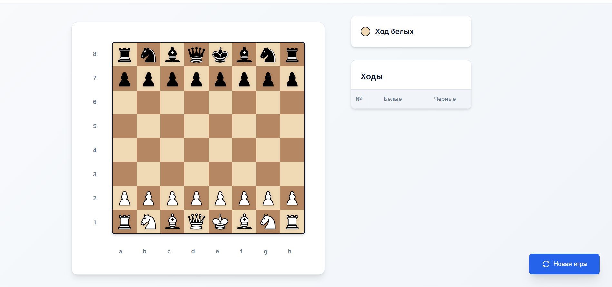

# MiniChess

Веб-приложение для игры в шахматы, построенное на Spring Boot с пользовательским интерфейсом.



## Основной функционал

- **Полноценная игра в шахматы** с соблюдением всех правил
- **Интерактивная доска** с визуальным отображением возможных ходов
- **Валидация ходов** - система проверяет корректность каждого хода
- **Обнаружение шаха** - автоматическое определение когда король под атакой
- **История ходов** - отображение всех сделанных ходов в партии
- **Новая игра** - возможность начать партию заново
- **Переворот доски** - возможность перевернуть доску для удобства игры

## 🛠 Технологии

### Backend
- **Java 21** 
- **Spring Boot 3.5.5**
- **Spring Web**
- **Spring Thymeleaf**

### Frontend
- **HTML5**
- **CSS3**
- **JavaScript**

## 🏗 Архитектура проекта

```
src/main/java/dev/ruslan/minichess/
├── controller/           
│   ├── BoardApiController.java    # REST API для игровой логики
│   └── ChessPageController.java   # Контроллер для главной страницы
├── service/              
│   └── GameService.java           # Обработка логики
└── MiniChessApplication.java 
```

## API Эндпоинты

### Основные эндпоинты

| Метод | Путь | Описание |
|-------|------|----------|
| `GET` | `/chess` | Главная страница игры |
| `GET` | `/api/board` | Получить текущее состояние доски |
| `GET` | `/api/moves?from={square}` | Получить возможные ходы для фигуры |
| `POST` | `/api/move` | Сделать ход |
| `GET` | `/api/move-list` | Получить историю ходов |
| `POST` | `/api/reset` | Начать новую игру |

### Примеры запросов

#### Получение состояния доски
```http
GET /api/board
```

**Ответ:**
```json
{
  "sideToMove": "WHITE",
  "inCheck": false,
  "whiteInCheck": false,
  "blackInCheck": false,
  "cells": [
    [{"type": "ROOK", "color": "WHITE"}, ...],
    ...
  ]
}
```

#### Получение возможных ходов
```http
GET /api/moves?from=e2
```

**Ответ:**
```json
{
  "from": "e2",
  "moves": ["e3", "e4"]
}
```

#### Выполнение хода
```http
POST /api/move
Content-Type: application/json

{
  "from": "e2",
  "to": "e4"
}
```

## Игровая логика

### Основные возможности

1. **Валидация ходов** - система проверяет:
   - Корректность движения фигуры согласно правилам
   - Не оставляет ли ход короля под шахом
   - Соблюдение очередности ходов

2. **Обнаружение шаха** - автоматическое определение:
   - Когда король находится под атакой
   - Какие фигуры атакуют короля

## Запуск приложения

### Требования
- Java 21 или выше
- Maven 3.6 или выше
- Установить зависимость [MiniChess-Core](https://github.com/True-Ruslan/MiniChess-Core)

### Установка и запуск

1. **Клонирование репозитория:**
```bash
git clone https://github.com/True-Ruslan/MiniChess.git
cd MiniChess
```

2. **Сборка проекта:**
```bash
mvn clean compile
```

3. **Запуск приложения:**
```bash
mvn spring-boot:run
```

4. **Открытие в браузере:**
```
http://localhost:8080/chess
```

## Тестирование

Проект включает полный набор тестов:

```bash
# Запуск всех тестов
mvn test

# Запуск с покрытием кода
mvn test jacoco:report
```

### Структура тестов
- `BoardTest.java` - тесты игровой доски
- `GameServiceTest.java` - тесты игровой логики
- `BoardApiControllerTest.java` - тесты API контроллера
- `ChessPageControllerTest.java` - тесты веб-контроллера

## 📝 Лицензия

Этот проект создан в образовательных целях и доступен под лицензией MIT.

## 👨‍💻 

Разработано как демонстрация, но может из этого что-то выйдет.

---

*Наслаждайтесь игрой в шахматы!* ♟️
